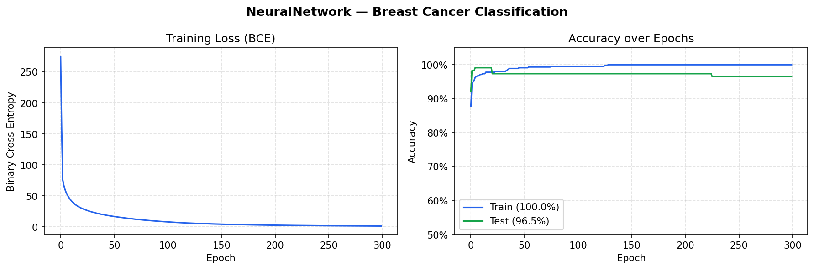

<div align="center">

# NeuralNetwork

**A from-scratch feedforward neural network implemented in pure NumPy.**

[](https://www.python.org/downloads/)
[](https://numpy.org/)
[](https://matplotlib.org/)
[](https://scikit-learn.org/)

</div>

---

A minimal, readable implementation of a fully-connected neural network built without any ML framework — just NumPy. Covers the full training loop: He weight initialization, forward pass (ReLU hidden + linear/sigmoid output), BCE or MSE loss, backpropagation, and gradient descent. Applied to real data: the Breast Cancer Wisconsin dataset. Built during the CS361-UCSP Artificial Intelligence course.

## Quickstart

```bash
git clone https://github.com/RayverAimar/neural-network.git
cd neural-network

python3 -m venv .venv
source .venv/bin/activate
pip install -r requirements.txt

python demo.py
```

## Demo output

`demo.py` trains a `30 → 64 → 32 → 1` network on the Breast Cancer Wisconsin dataset (455 train / 114 test samples) and saves `training_results.png`:



- **Left:** Binary cross-entropy loss over 300 epochs — drops sharply in the first ~20 epochs.
- **Right:** Train and test accuracy converging; the gap reveals slight overfitting after epoch ~150.

```
Dataset     : Breast Cancer Wisconsin
Classes     : malignant (0) vs benign (1)
Train/Test  : 455 / 114 samples | 30 features

Architecture: 30 → 64 → 32 → 1  (ReLU hidden, sigmoid output, BCE loss)
Learning rate: 0.001

Epoch    0 | Loss: 275.1677 | Train: 0.877 | Test: 0.921
Epoch   50 | Loss:  16.8628 | Train: 0.991 | Test: 0.974
Epoch  100 | Loss:   8.1438 | Train: 0.996 | Test: 0.974
Epoch  150 | Loss:   4.4807 | Train: 1.000 | Test: 0.974
Epoch  200 | Loss:   2.8540 | Train: 1.000 | Test: 0.974
Epoch  250 | Loss:   1.9901 | Train: 1.000 | Test: 0.965
Epoch  299 | Loss:   1.4801 | Train: 1.000 | Test: 0.965

--- Final Results ---
Train accuracy : 100.00%
Test accuracy  :  96.49%
Precision      :  0.9718
Recall         :  0.9718
F1 Score       :  0.9718

Confusion Matrix (test set):
  TP=69  FP=2
  FN=2   TN=41
```

## Usage

```python
import numpy as np
from sklearn.preprocessing import StandardScaler
from neural_network import NeuralNetwork

# Regression (linear output, MSE loss)
nn = NeuralNetwork(input_size=10, output_size=1, lr=1e-3, output_activation="linear")
nn.add_layer(64)
history = nn.train(X_train, y_train, epochs=200)
predictions = nn.predict(X_test)          # continuous values

# Binary classification (sigmoid output, BCE loss)
nn = NeuralNetwork(input_size=30, output_size=1, lr=1e-3, output_activation="sigmoid")
nn.add_layer(64)
nn.add_layer(32)
history = nn.train(X_train, y_train, epochs=300)
labels = nn.predict_classes(X_test)       # 0 or 1
acc = NeuralNetwork.accuracy(nn.predict(X_test), y_test)
```

> Input features should be normalized (e.g. `StandardScaler`) before training — the network is sensitive to feature scale.

## Theory

### Notation

| Symbol | Meaning |
|--------|---------|
| $L$ | number of layers (including output) |
| $W^{[l]}$ | weight matrix of layer $l$ |
| $b^{[l]}$ | bias vector of layer $l$ |
| $z^{[l]}$ | pre-activation of layer $l$: $z^{[l]} = h^{[l-1]} W^{[l]} + b^{[l]}$ |
| $h^{[l]}$ | activation of layer $l$ |
| $\hat{y}$ | network output ($h^{[L]}$) |

### Weight initialization — He

Random weights scaled by $\sqrt{2 / n_{\text{in}}}$ to keep activation variance stable across deep ReLU networks:

$$W^{[l]} \sim \mathcal{N}\!\left(0,\; \frac{2}{n^{[l-1]}}\right)$$

### Forward pass

Each **hidden** layer applies ReLU:

$$z^{[l]} = h^{[l-1]} W^{[l]} + b^{[l]}, \qquad h^{[l]} = \max(z^{[l]},\; 0)$$

The **output** layer uses a linear activation for regression or sigmoid for binary classification:

$$\text{linear:}\quad \hat{y} = z^{[L]} \qquad \text{sigmoid:}\quad \hat{y} = \sigma(z^{[L]}) = \frac{1}{1 + e^{-z^{[L]}}}$$

### Loss functions

**Mean squared error** (regression):

$$\mathcal{L}_{\text{MSE}} = \sum_i (\hat{y}_i - y_i)^2$$

**Binary cross-entropy** (classification):

$$\mathcal{L}_{\text{BCE}} = -\sum_i \bigl[y_i \log \hat{y}_i + (1 - y_i) \log(1 - \hat{y}_i)\bigr]$$

### Backward pass — chain rule

Starting from the output layer and propagating backwards:

**Output gradient:**

$$\delta^{[L]} = \frac{\partial \mathcal{L}}{\partial z^{[L]}} = \begin{cases} 2(\hat{y} - y) & \text{MSE + linear} \\ \hat{y} - y & \text{BCE + sigmoid (combined)} \end{cases}$$

The BCE + sigmoid form simplifies cleanly because $\frac{d\sigma}{dz} = \sigma(1-\sigma)$ cancels with the loss derivative.

**Hidden layer gradient** (ReLU derivative is a step function):

$$\delta^{[l]} = \left(\delta^{[l+1]} {W^{[l+1]}}^{\top}\right) \odot \mathbf{1}[z^{[l]} > 0]$$

**Weight and bias gradients:**

$$\frac{\partial \mathcal{L}}{\partial W^{[l]}} = {h^{[l-1]}}^{\top}\, \delta^{[l]}, \qquad \frac{\partial \mathcal{L}}{\partial b^{[l]}} = \sum_{\text{batch}} \delta^{[l]}$$

### Gradient descent update

$$W^{[l]} \leftarrow W^{[l]} - \eta \frac{\partial \mathcal{L}}{\partial W^{[l]}}, \qquad b^{[l]} \leftarrow b^{[l]} - \eta \frac{\partial \mathcal{L}}{\partial b^{[l]}}$$

where $\eta$ is the learning rate.

## Parameters

| Parameter | Description | Default |
|-----------|-------------|---------|
| `input_size` | Number of input features | — |
| `output_size` | Number of output neurons | — |
| `lr` | Learning rate ($\eta$) | — |
| `output_activation` | `"linear"` (regression) or `"sigmoid"` (binary classification) | `"linear"` |
| `epochs` | Training iterations | `100` |
| `log_every` | Print cost every N epochs | `50` |

## Project structure

```
neural-network/
├── neural_network.py      # NeuralNetwork class — core algorithm
├── demo.py                # Breast Cancer classification demo
├── training_results.png   # Output of demo.py (committed for the README)
├── requirements.txt
└── README.md
```

## Notes

This project is intended for **educational purposes** — it demonstrates the mechanics of backpropagation without framework abstractions. For production use, prefer [PyTorch](https://pytorch.org/) or [TensorFlow](https://www.tensorflow.org/).
